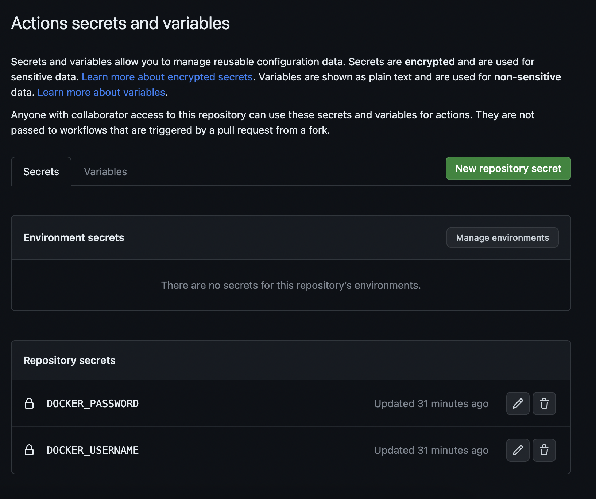
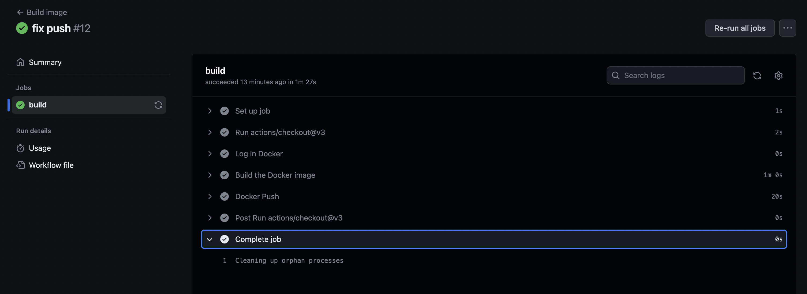
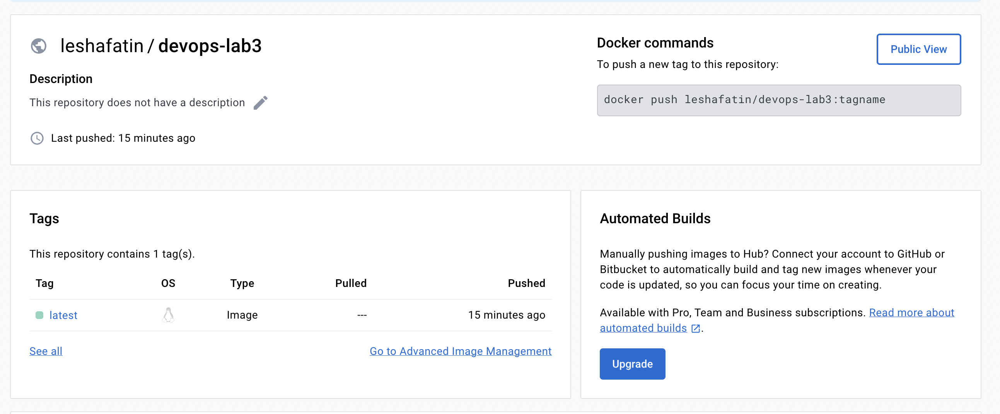

# Лабораторная работа 3

## Цель работы

Сделать, чтобы после пуша в ваш репозиторий автоматически собирался докер образ и результат его сборки сохранялся куда-нибудь. (например, если результат - текстовый файлик, он должен автоматически сохраниться на локальную машину, в ваш репозиторий или на ваш сервер).

## Шаги

1. Для этой лабораторной работы был создан отдельный Github-репозиторий
2. Возьмем Dockerfile из предыдущей лабораторной работы
3. Создадим `.yaml` файлик через вкладку Actions Github'a, в процессе некоторой войны с отступами и другими ошибками получился следующий workflow:

```
  name: Build image //название action'a

  on: // что его триггерит, в данном случае, пуш и ПР в ветку main, запуск из вкладки actions
    push:
        branches: [main]
    pull_request:
        branches: [main]
    workflow_dispatch:

  jobs:
    build:
        runs-on: ubuntu-latest

        steps:
        - uses: actions/checkout@v3 // для доступа к репозиторию из .yml
        - name: Log in Docker
            run: docker login -u ${{ secrets.DOCKER_USERNAME }} -p ${{ secrets.DOCKER_PASSWORD }}
            // достаем из секретов репозитория креды для docker hub'a
        - name: Build the Docker image
            run: docker build . --file Dockerfile --tag leshafatin/devops-lab3
        - name: Docker Push
            run: docker push leshafatin/devops-lab3
```

4. Закидываем username и токен с dockerhub'a в секреты репозитория



5. Готово! Action выполнил все шаги, а образ есть на Dockerhub'e

   
   <hr/>
   <br/>

   Dockerhub:

   
